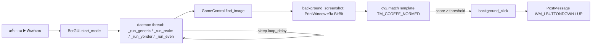

# สถาปัตยกรรม

## Flow การทำงานของโหมด

## ส่วนประกอบ

**`main.py`: `BotGUI`**
- `MODE_NAMES` กำหนดลำดับแท็บ, `MODE_TEMPLATE_KEYS` จับคู่โหมดกับ section ใน config, `EVEN_STEPS` คือลำดับการกดของโหมด even
- `load_configuration()` รวม `shared_templates` เข้ากับ template ของแต่ละโหมด ถ้า key ซ้ำ ค่าของโหมดจะทับค่า shared แล้วแปลง path ด้วย `resource_path()` (`main.py:178`)
- `start_mode` / `stop_mode` ควบคุมผ่าน flag `mode["running"]` และสถานะปุ่ม (`main.py:212`)
- `_get_run_target` เลือก loop ตามโหมด (`main.py:243`)
- `_ensure_bot()` สร้าง `GameControl` ครั้งแรกครั้งเดียว แล้วใช้ตัวเดียวกันทุกโหมด (`main.py:258`)

**`lib/game_control.py`: `GameControl`**
- หา window ด้วย `FindWindow` แบบชื่อตรง ถ้าไม่เจอจะลองหาชื่อที่มีคำนั้นอยู่ ถ้ายังไม่เจอจะ print รายชื่อ window ที่เปิดอยู่แล้ว raise
- `background_screenshot()` จับภาพทั้ง window รวม title bar ถ้าหน้าต่างถูกพับ (minimize) จะ error (`game_control.py:52`)
- `find_image()` คืนพิกัด **กลาง template แบบ window-relative** (`game_control.py:103`)
- `background_click()` แปลงพิกัด window → screen → client แล้ว `PostMessage` (`game_control.py:169`)
- `click()` เป็นวิธีคลิกแบบ foreground ที่ขยับเมาส์จริง ตอนนี้ไม่มีโค้ดส่วนไหนเรียกใช้

**`lib/updater.py`** ดูรายละเอียดที่ [[Project/Build and Release#Auto-update]]

## Threading
- แต่ละโหมดรันใน daemon thread ของตัวเอง หลายโหมดรันพร้อมกันได้ และทุกโหมดใช้ `self.bot` ตัวเดียวกัน
- เมื่อเกิด error ใน thread จะ log แล้วเรียก `root.after(0, stop_mode)` เพื่อคืนสถานะปุ่มผ่าน UI thread
- ความเสี่ยงที่ยังค้างอยู่ดูได้ที่ [[Known Issues]]

## Startup
`main()` สร้าง GUI ก่อน แล้วใช้ `root.after(500)` เช็คอัปเดต หน้าต่างจึงขึ้นทันทีแม้เน็ตจะช้า